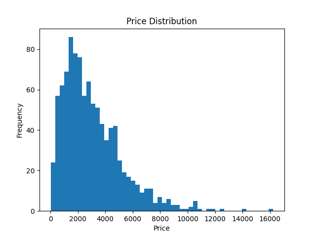
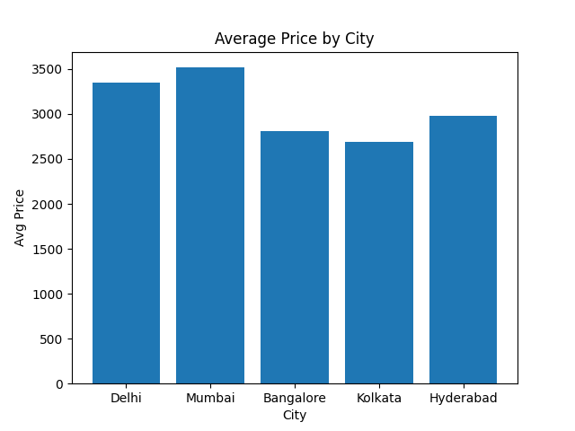
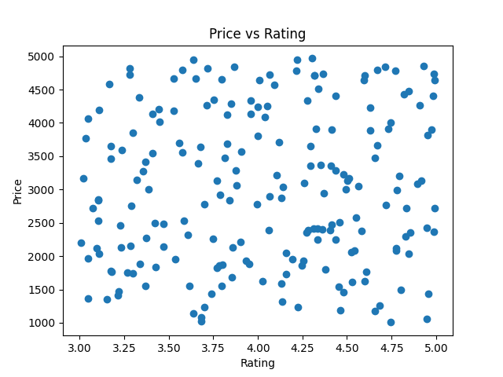
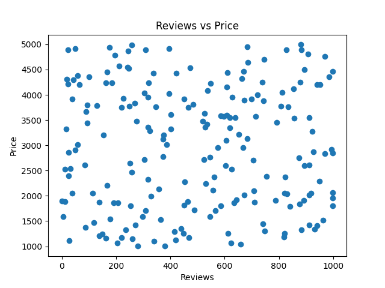
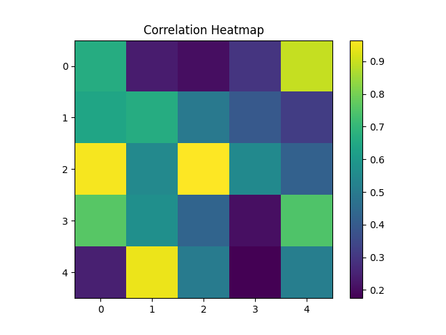

# 🏨 Indian Hotel Market Analysis (OYO-Style Dataset)

## 📌 Project Overview
This project analyzes hotel listings across major Indian cities to uncover patterns in pricing, customer demand, and service quality. Using Python-based exploratory data analysis (EDA), the study identifies key factors influencing hotel performance and provides actionable business recommendations.

---

## 🎯 Objectives
- Understand hotel price distribution across cities and room types  
- Analyze relationships between price, ratings, and customer engagement  
- Identify high-demand locations and pricing patterns  
- Derive business insights to optimize pricing and occupancy  

---

## 🗂️ Dataset Description
The dataset contains hotel listing information with the following features:

- **Price** – Cost per night  
- **Rating** – Customer rating (1–5 scale)  
- **Reviews** – Number of customer reviews  
- **City** – Location of hotel  
- **Area** – Specific locality within city  
- **Room Type** – Category (Classic, Deluxe, Suite, etc.)  
- **Discount** – Discount percentage  
- **Availability_365** – Availability throughout the year  

---

## ⚙️ Tools & Technologies
- Python  
- Pandas  
- NumPy  
- Matplotlib  
- Seaborn  
- Jupyter Notebook  

---

## 🔄 Project Workflow
1. Data Cleaning & Preprocessing  
2. Univariate Analysis  
3. Bivariate Analysis  
4. Multivariate Analysis  
5. Advanced Insights & Feature Relationships  
6. Business Recommendations  

---

## 📊 Key Visualizations

### Price Distribution

### Average Price by City

### Price vs Rating

### Reviews vs Price

### Correlation Heatmap

---

## 🔍 Key Insights

- Hotel pricing is strongly influenced by **city and room type**, with metro cities commanding higher prices  
- The market is dominated by **budget and mid-range hotels**, indicating high demand in these segments  
- **Moderate pricing combined with strong ratings** leads to higher customer engagement  
- Price shows **weak correlation with ratings**, suggesting value perception matters more than cost  
- Discounts are primarily applied in **mid-tier segments** to drive bookings  
- Premium listings exist as **outliers**, representing a niche luxury market  
- Demand is concentrated in **high-access areas** such as city centers and transit zones  

---

## 💡 Business Recommendations

- Focus on expanding **mid-range hotel offerings** to capture the largest demand segment  
- Implement **city-specific pricing strategies** based on demand and competition  
- Adopt a **value-based pricing model** rather than premium-only positioning  
- Use **targeted discounts in mid-tier segments** to increase occupancy  
- Invest in **high-demand areas** for better revenue potential  
- Encourage **customer reviews and engagement** to improve visibility  
- Treat **premium listings separately** with distinct pricing and marketing strategies  

---

## 📈 Conclusion
The analysis highlights that hotel market performance is driven by a combination of pricing, location, and customer perception. A strategic approach focusing on mid-range offerings, optimized pricing, and customer engagement can significantly enhance both demand and revenue.

---

👨‍💻 Author

Yusuf M
Aspiring Data Analyst | Python | SQL | Power BI

⭐ If you found this project useful, consider giving it a star!
