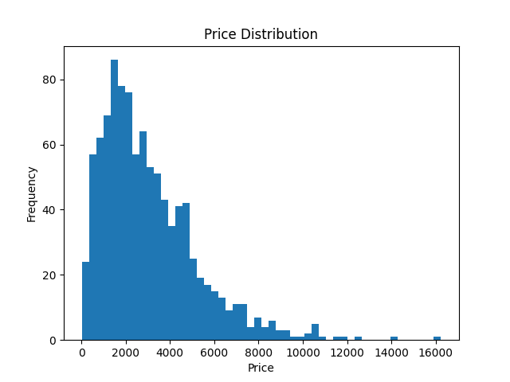
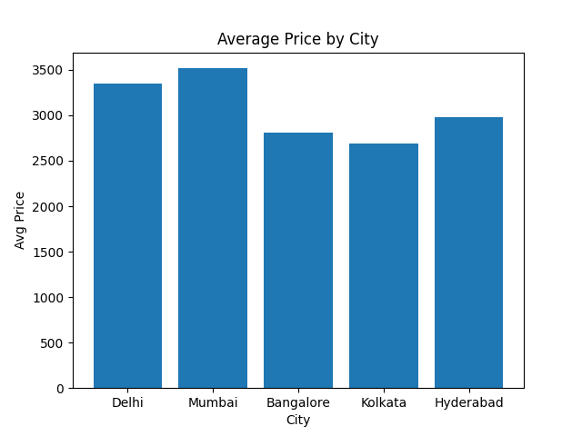
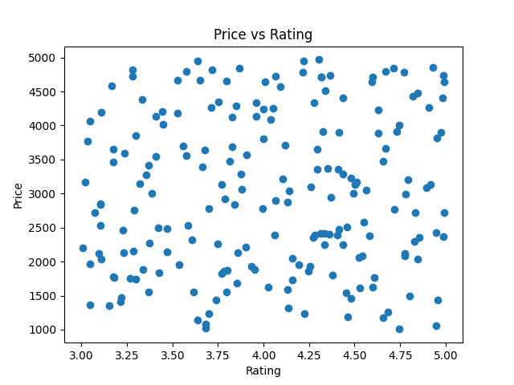
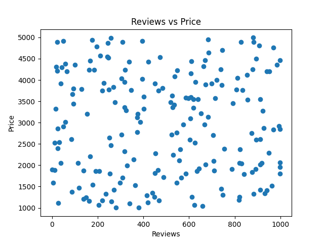
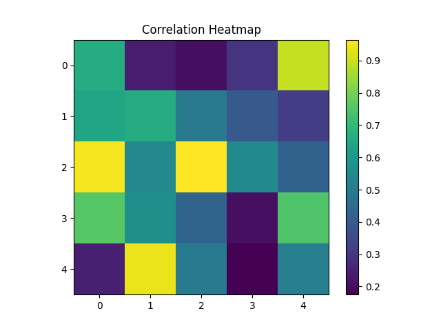

# 🏨 OccuRate — Hotel Revenue & Occupancy Analytics (India)

**Turning 982 OYO listings across 10 Indian cities into a pricing and occupancy strategy — not just a chart pack.**


---

## TL;DR

- **982 hotel listings** across **10 cities** and **4 room tiers**, cleaned from a genuinely messy raw export (currency symbols, "No reviews" strings, percentage text, inconsistent casing).
- Core finding: **price and rating are almost uncorrelated** — guests are paying for perceived value and location, not a premium tier. Revenue strategy should follow that signal, not fight it.
- Deliverable is a full analyst workflow: raw → cleaned dataset → EDA → segmentation-ready insights → pricing and occupancy recommendations a revenue manager could act on.

---

## Business Problem

Independent and budget-hotel operators (the OYO model) compete on volume, not brand premium. The commercial questions that matter to a revenue manager are simple to ask and hard to answer without structured data:

- Where is pricing power actually coming from — city, room type, or location within a city?
- Does raising price come at the cost of rating or reviews, or is the market indifferent?
- Which segments are under-priced relative to demand, and which are over-discounted?
- Where should marketing and inventory investment go to move occupancy, not just prices?

This project treats the OYO India listings dataset as a stand-in for that operator's portfolio and answers those questions end to end.

---

## Objectives

1. Quantify how price varies by city, area, and room type.
2. Test whether rating and reviews actually explain price — or whether the market is pricing on something else.
3. Identify which price/room-type segments carry the most listings (i.e., where the real market is).
4. Convert the above into pricing and occupancy recommendations, not just descriptive charts.

---

## Dataset

**982 listings, 10 columns**, scraped-style OYO data across Mumbai, Delhi, Bangalore, Chennai, Hyderabad, Pune, Kolkata, Ahmedabad, Jaipur, and Goa.

| Column | Description |
|---|---|
| `hotel_id`, `hotel_name` | Listing identifiers |
| `city`, `area` | Location (city + locality, e.g. MG Road, Whitefield, Connaught Place) |
| `room_type` | Classic, Deluxe, Suite, Premium |
| `price` | Nightly rate (₹) |
| `rating` | Customer rating, 1–5 |
| `reviews` | Review count |
| `discount` | Discount applied (%) |
| `availability_365` | Days available per year |

**The raw file was not analysis-ready**, which is itself part of the case study: prices arrived as `₹6214`, `8273 INR`, and plain numbers in the same column; review counts contained the literal string `"No reviews"`; room types were inconsistently cased (`Deluxe` / `DELUXE` / `deluxe`); discounts mixed `"43%"` strings with raw numbers. Cleaning this into the 982-row analysis-ready table was a deliberate first step, not an afterthought — see `Python_Notebook/Indain_Hotels_Analysis.ipynb` for the full cleaning logic.

---

## Methodology

1. **Data Cleaning** — strip currency symbols/suffixes, coerce numeric types, standardize categorical casing, resolve `"No reviews"` → `0`, handle missing values.
2. **Univariate Analysis** — distribution of price, rating, reviews, discount, availability.
3. **Bivariate Analysis** — price vs. city, price vs. room type, price vs. rating, reviews vs. price.
4. **Multivariate Analysis** — correlation structure across all numeric features.
5. **Segment Sizing** — where listing volume concentrates (city, room type, price band).
6. **Business Recommendations** — pricing, discounting, and occupancy actions tied back to the above.

---

## Tech Stack

| Layer | Tools |
|---|---|
| Language | Python |
| Data wrangling | Pandas, NumPy |
| Visualization | Matplotlib, Seaborn |
| Environment | Jupyter Notebook |

---

## Key Visualizations

### Price Distribution


### Average Price by City


### Price vs. Rating


### Reviews vs. Price


### Correlation Heatmap


---

## Key Insights

- **Location and room type drive price far more than rating does.** Price varies meaningfully by city and tier, but shows a weak correlation with rating across the full dataset — guests aren't paying a premium purely for a higher star rating.
- **Deluxe and Classic listings dominate the market** (327 and 323 of 982 listings respectively), with Suite and Premium making up a smaller, more niche share — confirming this is fundamentally a budget/mid-market, not a luxury, market.
- **Discounting is concentrated in the mid-tier**, used as an occupancy lever rather than applied uniformly.
- **High-review listings cluster at moderate price points**, suggesting that perceived value, not lowest price, is what drives repeat engagement.
- **Premium-priced outliers exist in every city**, functioning as a separate niche segment rather than the top of a single continuous pricing curve.

---

## Business Recommendations

- **Price by segment, not by brand.** City + room type explains more price variance than any single "premium" positioning would — pricing strategy should be localized, not blanket.
- **Protect the Deluxe/Classic core.** These two tiers carry the majority of listings; occupancy and revenue programs should prioritize them over chasing Premium-tier volume.
- **Target discounts, don't spread them.** Concentrate promotional spend on mid-tier listings with low availability turnover, where a discount is most likely to convert to a booked night.
- **Treat Premium/Suite as a distinct product**, not a scaled-up version of Classic/Deluxe — separate pricing, marketing, and guest-experience investment.
- **Invest in review generation in high-traffic areas** (e.g., MG Road, Connaught Place, Airport Road clusters) since review volume — not just rating — correlates with sustained demand.

---

## Limitations & Next Steps

- The dataset is a single snapshot; there's no time dimension, so seasonality and demand trends aren't modeled here.
- `rating` has an unusually high concentration at one value (3.6) after cleaning, which likely reflects imputation in the source data rather than true guest behavior — flagged here rather than hidden, and worth revisiting if a cleaner source becomes available.
- Natural next step: layer in a time-series or booking-window dimension to move from *descriptive* pricing insight toward a *predictive* occupancy/demand model.

---

## Repository Structure

```
OccuRate-Hotel-Revenue-Optimization-Occupancy-Analytics/
├── Data/
│   ├── oyo_india_hotels_raw.csv
│   └── oyo_india_hotels_cleaned.csv
├── Python_Notebook/
│   └── Indain_Hotels_Analysis.ipynb
├── images/
└── README.md
```

---

## Author

**Md Yusuf**
Data Analyst | Revenue · Margin · Category Analytics | SQL · Power BI · Python

🔗 [GitHub — mdyusufanalytics](https://github.com/mdyusufanalytics) · Portfolio: [mdyusufanalytics.github.io](https://mdyusufanalytics.github.io)

Part of a broader portfolio applying commercial and P&L judgment to structured data problems — see also the [SaaS Metrics Intelligence Dashboard](https://github.com/Yusufmd24/SaaS-Metrics-Intelligence-Dashboard) for a full-stack SQL + Power BI case study.

⭐ If this was useful, a star is appreciated.
